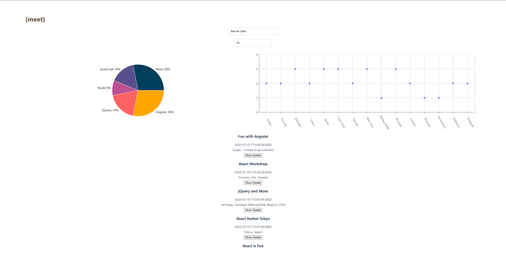

# Meet App: Achievement 4 Project

## Objective

Build a serverless, progressive web application (PWA) with React employing a test-driven development (TDD) approach. The app utilizes the Google Calendar API to display upcoming events.

## Context

Merging serverless with PWAs, the future of web development, this app takes the best of both worlds:

- **Serverless**: Scalable, always available, zero backend maintenance, cost-effective.
- **PWAs**: Instant loading, offline capabilities, notifications, responsive, cross-platform support.

Utilizing TDD, the app provides instant feedback, ensures adherence to requirements, and facilitates high-quality code production. Data visualization techniques, including scatterplots and pie charts, enhance user engagement, aiding in better data comprehension.

## The 5 Ws

- **Who**: Meet app users including peers, network, and potential employers.
- **What**: A PWA with offline capability and serverless backend developed using TDD.
- **When**: Accessible anytime for viewing events in a city. Code available on GitHub.
- **Where**: Serverless function on a cloud provider with offline user access and responsiveness across devices.
- **Why**: Embracing next-gen cloud infrastructure, exceptional user experience, code quality assurance, and setting you apart as a developer.

## Features & User Stories

**Key Features**:

- Filter events by city.
- Display/hide event details.
- Specify number of events.
- Offline access.
- Add app shortcut on home screen.
- Visualize event data with charts.

**User Stories** include:

- Filtering events by city.
- Toggling event details.
- Specifying the number of visible events.
- Offline app usage.
- Adding app to the home screen.
- Viewing event distribution across cities via charts.

## Technical Requirements

- React application.
- TDD implementation.
- Integration with Google Calendar API & OAuth2 authentication.
- Serverless functions via AWS lambda.
- Hosted on GitHub.
- Compatibility with popular browsers including IE11.
- Responsiveness from 1920px to 320px screen widths.
- PWA checklist adherence.
- Offline/slow network adaptability.
- Desktop installable with mobile home screen addition.
- Alerts using OOP.
- Data visualization.
- Test coverage >= 90%.
- Online performance monitoring.

## Mock-ups & Assets

Refer to the provided mockups to understand the app's layout and visuals in different contexts and screen sizes.

## Project Features & Scenarios

Detailed scenarios for each feature can be found in the subsequent sections.

